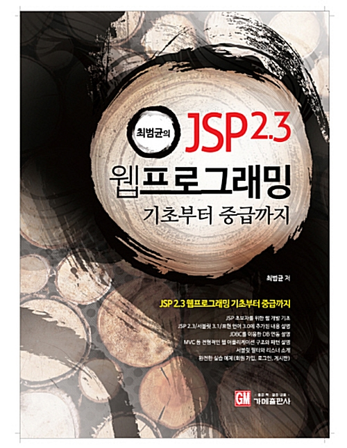
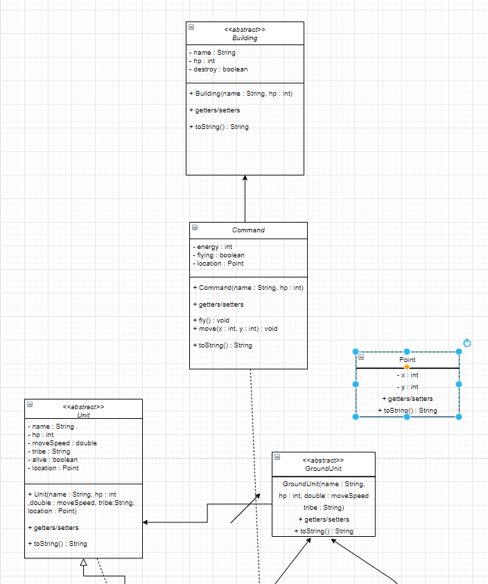
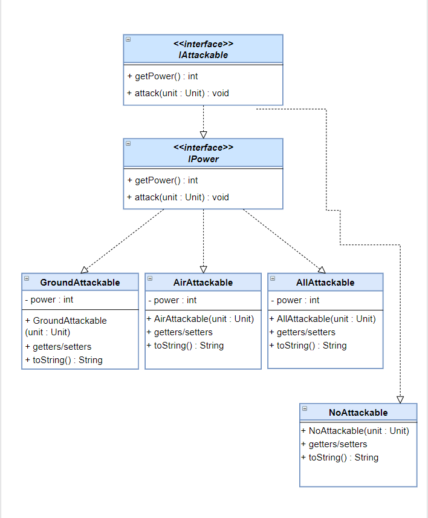
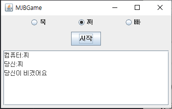
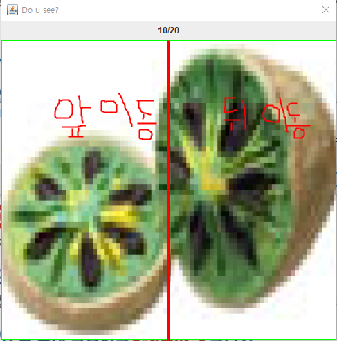
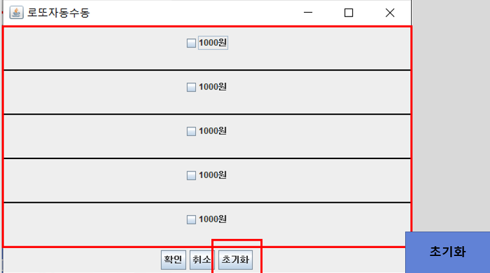

JAVA base DigitalConvergence Developer
===
### 목적
**

정보
**
> * 디지털 기술을 기반으로 다양한 기기의 융합, 네트워크의 융합, 콘텐츠의 융합을 통해 새로운 형태의 제품이나 융합서비스를 창출하기 위하여 기기, 네트워크, 콘텐츠의 기획, 설계, 제작, 운용 및 시험
> * 컴퓨터 프로그래밍 언어로 각 업무에 맞는 소프트웨어의 기능에 관한 설계, 구현 및 테스트를 수행하고, 사용자에게 배포하며, 버전관리를 통해 제품의 성능을 향상시키고, 서비스를 개선
> * 소프트웨어 구현, 소스 코드 인스펙션
> * 애플리케이션 모듈 구현, 인터페이스 구현
> * UI 설계 산출물과 GUI 디자인 가이드를 바탕으로 UI 구현 표준을 수립하고 UI를 제작
> * 데이터베이스 구현을 위하여 DBMS(Data Base Management System)(DataBase Management Systems) 설치, 데이터베이스 생성, 데이터베이스 오브젝트를 계획, 설계하고 구현
> * 관계형 데이터베이스에서 SQL을 사용하여 응용시스템의 요구기능에 적합한 데이터를 정의하고, 조작하며, 제어

## 교재
  **

정보
**

####
> 

> **03-16 ~ 05, api포함(Collection(List, Set), Map(Hashing), (String, StringBuffer, StringBuilder)), JavaSwing, InnerClass, Anonymous InnerClass, 람다식, file(Read,Write)**

> 

> **~**

> 

> **~**

> 

> **~**

> 

> **~**

## 실습

**

VendingMachine UML
**

//VendingMachine has-a Beverage
//VendingMachine has-a Money
|      VendingMachine   |
|:------------|
|**멤버변수**|
|- color : String|
|- balance : int|
|- manufacturer : String|
|- money : Money|
|- coin : Money |
|- coke : Beverage|
|- pepsi : Beverage|
|- powerAde : Beverage|
|- sprite : Beverage|
|- cider : Beverage|
|**static 상수**|
|+ D_COKE : int = 1|
|+ D_PEPSI : int = 2|
|+ D_POWERADE : int = 3|
|+ D_SPRITE : int = 4|
|+ D_CIDER : int = 5|
|**메소드**|
|getters / setters|
|+ VendingMachine(color : String, manufacturer : String, coke : Beverage, pepsi : Beverage, powerAde : Beverage, sprite : Beverage, cider : Beverage, money : Money, Coin : Money)
|+ inputMoneySum() : void|
|+ choicePick() : Beverage|
|- returnDrink(beverage : Beverage, balance : int, drink : int) : Beverage
|+ returnMoney() : int|
|- drinkDecrease(drink : int)|
|- soldOut(number : int) : boolean|
|+ toString() : String|

|Beverage|
|:--------|
|**멤버변수**|
|- name : String |
|- count : int|
|- amount : int|
|**메소드**|
|+ Beverage(name : String, amount : int, count : int)|
|+ Beverage(name : String, amount : int)|
|+ getters/setters|
|+ toString() : String|

|Money|
|:------|
|**멤버변수**|
|- tenThousandM : int|
|- fiveThousandM : int|
|- oneThousandM : int|
|- fiveHundredC : int|
|- oneHundredC : int|
|**메소드**|
|+ getters/setters|
|+ moneySum() : int|
|+ coinSum() : int|
|+ toString() : String|

**

StarUnit UML
**

**((interface)) IPowerUpgrade, IMoveUpgrade, IAllAttack, IHeal**

**((abstract)) Unit**

**((abstract)) GroundUnit is-a Unit**

**((abstract)) AirUnit is-a Unit**

**Zealot is-a GroundUnit is-a IMoveUpgrade,IGroundAttack,IPowerUpgrade**

**Mutallisk is-a AirUnit is-a IAllAttack, IPowerUpgrade**

**Medic is-a GroundUnit is-a IHeal**

**((abstract)) Building**

**((abstract)) MovingBuilding is-a Building**

**Command is-a MovingBuilding**

**Nexus is-a Building**

**

Design Pattern
**

**UML**

**

Lotto UML
**

**

JavaSwing 연습
**
### JFrame Practice

##### Answer1

##### Answer2

##### Answer3

##### Answer4

---

### Event Practice

##### 1. 묵찌빠

##### 2. Fruits Dialog

**

Lotto GUI
**
## Lotto GUI(프로젝트 5.20 ~ 5.22)

##### [Code 클릭](https://github.com/etg-git/JavaDeveloperDigitalConvergence/tree/master/projectCollection/Event/LottoGame)

##### (1) LottoIntro

##### (2) LottoSlot 처음 창 띄웠을때

##### (3) LottoSlot 체크를 할때

##### (4) LottoSlot 자동 눌릴때

##### (5) LottoSlot 자동 저장

##### (6) LottoSlot 수동 눌릴때

##### (7) LottoSlot 수동 저장

##### (8) 초기화

##### (9) 결과창

##### (10) lucky

**

File
**

##### Read, Write 참고

##### 1. 메모장의 메뉴바 메뉴만들기

* document(insertUpdate)
  * 파일이 업데이트 될때 frame의 title에 * 추가
* 새로만들기(Ctrl + n)
  * File이 null인지, 불러오기했는지
* open
  * 이전파일 저장할건지의 여부(JOptionPane)
  * File 불러오기
* save(Ctrl + s)
  * open 파일을 저장
  * 파일이 null일때 다른이름으로 저장
* saveAs
  * 다른이름으로 저장(JFileChooser)
* exit
  * 지금 파일을 저장할건지의 여부(JOptionPane)

##### 2. 로그인,회원가입UI

* 텍스트파일에 회원정보 저장
* 로그인 창
  * 회원정보 없을때
  * 아이디와 패스워드 일치할때
* 회원가입 창
  * 아이디 입력 여부
  * 패스워드, 재확인 입력 여부, 6자이상
  * 이름 여부
  * 닉네임 여부
  * 성별 클릭 여부
  * 패스워드와 재확인 일치하는지 여부
  * 동일한 아이디있는지 여부
* 회원정보 창
  * TextArea에 회원정보 내용
  * 로그아웃 기능
  * 회원탈퇴(텍스트 파일에 회원정보 삭제)

##### 3. 주제 자유

