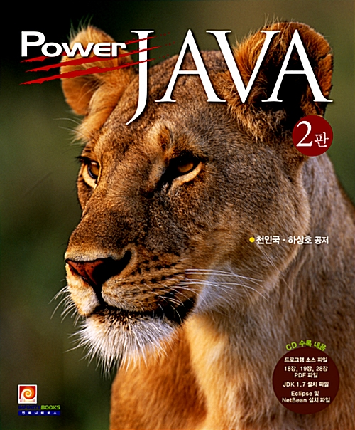

```JAVA base DigitalConvergence Developer```
===
## 목적
**<details><summary>정보</summary>**
> * 디지털 기술을 기반으로 다양한 기기의 융합, 네트워크의 융합, 콘텐츠의 융합을 통해 새로운 형태의 제품이나 융합서비스를 창출하기 위하여 기기, 네트워크, 콘텐츠의 기획, 설계, 제작, 운용 및 시험
> * 컴퓨터 프로그래밍 언어로 각 업무에 맞는 소프트웨어의 기능에 관한 설계, 구현 및 테스트를 수행하고, 사용자에게 배포하며, 버전관리를 통해 제품의 성능을 향상시키고, 서비스를 개선
> * 소프트웨어 구현, 소스 코드 인스펙션
> * 애플리케이션 모듈 구현, 인터페이스 구현
> * UI 설계 산출물과 GUI 디자인 가이드를 바탕으로 UI 구현 표준을 수립하고 UI를 제작
> * 데이터베이스 구현을 위하여 DBMS(Data Base Management System)(DataBase Management Systems) 설치, 데이터베이스 생성, 데이터베이스 오브젝트를 계획, 설계하고 구현
> * 관계형 데이터베이스에서 SQL을 사용하여 응용시스템의 요구기능에 적합한 데이터를 정의하고, 조작하며, 제어

</details>

## 교재
  **<details><summary>정보</summary>**
####
> 

> **03-16** ~

> 

> **~**

> 

> **~**

</details>
